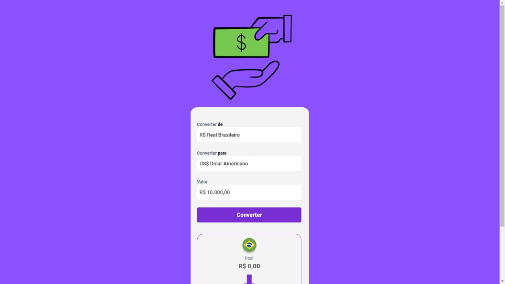
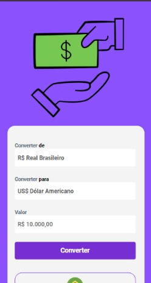

<h1>Conversor de Moedas</h1>
 
 
<h2>O meu primeiro projeto utilizando JavaScript :)
 
 
Segue para imagens do projeto:</h2>

Obs: Este é um projeto responsivo

 <figure>

  <figcaption>Print da tela do projeto para computador</figcaption>
  </figure>
 
 
 
 
 
 
<figure>

  <figcapiton>Print da tela do projeto para celular</figcapiton>
</figure>

